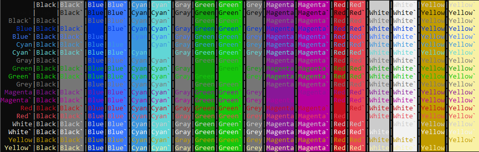
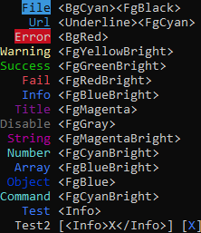

## Вывод разноцветного текста в консоль с помощью тегов

Пакет основан на пакете [chalk/ansi-styles](https://github.com/chalk/ansi-styles) и добавляет возможность выводить разноцветный текст с использованием тегов

```js
const terminal = require("terminal-write");

const text = '<FgBlue>terminal</FgBlue><Success>-</><BgBlue>write</>';
terminal.hr('<Title>', '#', terminal.strip_tags(text).length);
terminal.writeLn(text);
terminal.hr('<Warning>', '@', terminal.strip_ansi(terminal.parse(text)).length);
```


Теги могут содержать закрывающий тег который заканчивает действие открывающего тега. Тег `</>` / `<Reset>` позволяет закончить действие всех тегов. Теги регистронезависимы. 
```js
// Код ниже выведет одно и тоже
terminal.writeLn('<fgRed>zzz');
terminal.writeLn('<FGRED>zzz');
terminal.writeLn('<fgred>zzz');
```


### Поддерживаемые цвета



### Модификаторы


### Преднастройки



### Добавление своих настроек
```js
// Добавляем новый тег (заменяем существующий)
terminal.addTag('Test', '<fgRed><bgCyan>')
terminal.writeLn('<Test>Test</> <string>string</>');
// Удаляем тег
terminal.removeTag('test')
terminal.writeLn('<Test>Test</> <string>string</>');
```


```js
// Клонируем
const terminalTest = terminal.clone();
// Добавляем новый тег
terminalTest.addTag('Test', '<fgRed><bgCyan>')
// Выводим
terminalTest.write('<Test>terminalTest</>');
terminal.writeLn('<Test>terminal</>');
// Заменяем исходный терминал клонированным
terminal.replace(terminalTest);
terminal.writeLn('<Test>terminal after replace</>');
```
